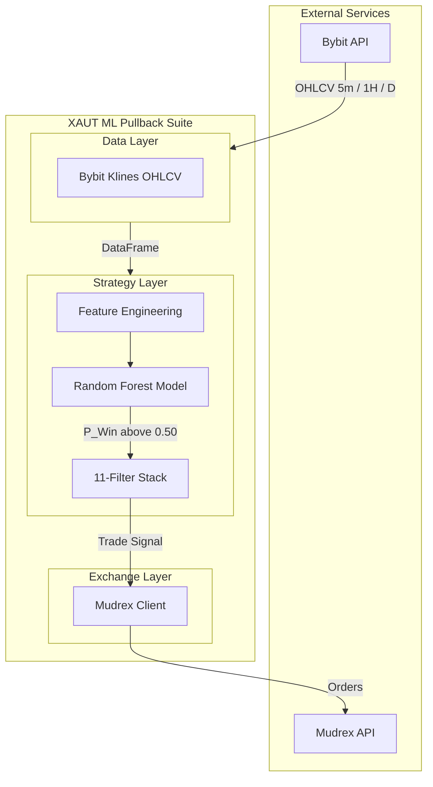
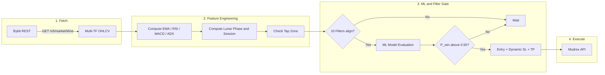
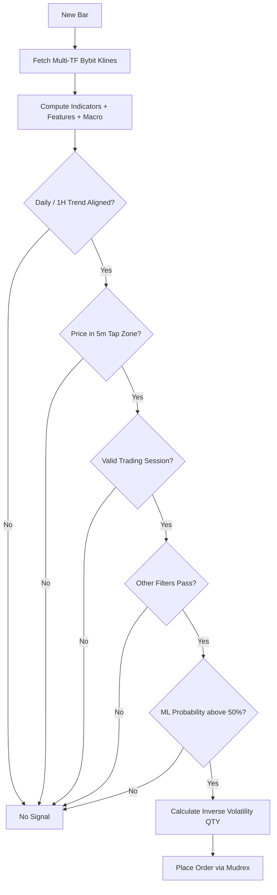
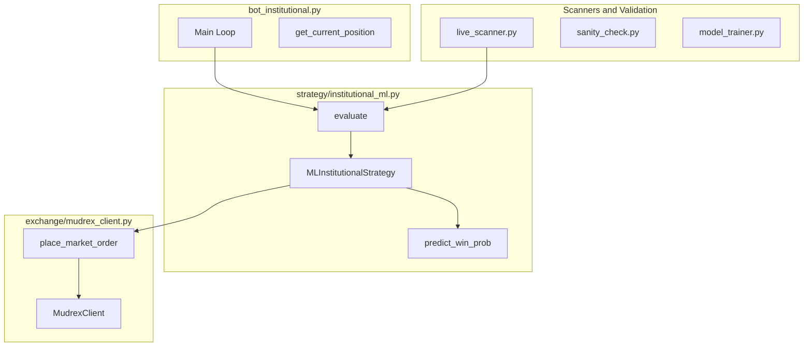

# XAUT Institutional ML EMA Pullback Strategy

Production-ready, high-alpha strategy for **XAUTUSDT** futures, deployable to Railway.
Uses a 5-minute EMA pullback logic reinforced by 11 systematic filters and a Walk-Forward validated Random Forest model.

- **Execution**: [Mudrex Futures API](https://docs.trade.mudrex.com/docs/overview)
- **Prices**: Bybit klines (Mudrex uses Bybit as broker)

---

## The 11-Filter Stack

The bot executes a trade only when all conditions align:

### Macro Filters
1. **Macro Trend** — Price must be above (Long) or below (Short) the Daily EMA200.
2. **High-TF Momentum** — 1H EMA21 must align with the 1H macro trend (EMA200).
3. **Real Volume** — Current 5m volume must exceed the 20-bar moving average.

### Execution (Pullback) Filters
4. **EMA Pullback** — Price must pull into a 0.20% tap zone of the 5m EMA21.
5. **Score Alignment** — At least 5 of 7 technical signals must align (RSI, MACD, ADX, etc.).
6. **Session Filter** — Trading restricted to Tue–Thu, 08:00–19:00 UTC (highest liquidity).
7. **Anti-Chop** — 1H ADX above 20 required to confirm trending, not ranging conditions.

### Advanced Quant Filters
8. **Lunar Cycle** — Avoids trading near Full Moon phases (quant-verified edge).
9. **Inverse Volatility Sizing** — Position size is dynamically reduced during high-volatility spikes.
10. **Institutional ML** — A Random Forest model evaluates 32 institutional features; trade is skipped if P(win) < 0.50.
11. **Walk-Forward Validation** — Model integrity is ensured across shifting market regimes (retrained for 2025-2026 conditions).

---

## System Architecture



---

## Data Flow



---

## Strategy Logic Flow



---

## Component Architecture



---

## Deployment

### Credentials

Set `MUDREX_API_SECRET` in your `.env` or Railway environment variables.

### Installation

```bash
git clone https://github.com/DecentralizedJM/XAUT-EMA-Pullback-Strategy.git
cd XAUT-EMA-Pullback-Strategy
pip3 install -r requirements.txt
cp .env.example .env
# Edit .env and add MUDREX_API_SECRET
```

### Modes

| Command | Description |
|---|---|
| `python3 bot_institutional.py` | Live trading |
| `python3 bot_institutional.py --paper` | Paper trading |
| `python3 backtest_3m.py` | Run local 3-month backtest |
| `python3 live_scanner.py --once` | Single scan |
| `python3 model_trainer_api.py` | Retrain ML model (via Bybit API) |
| `python3 sanity_check.py` | Deep diagnostics |

---

## Deploy to Railway

1. Push to GitHub: [DecentralizedJM/XAUT-EMA-Pullback-Strategy](https://github.com/DecentralizedJM/XAUT-EMA-Pullback-Strategy)
2. Create a Railway project and deploy from GitHub.
3. Add `MUDREX_API_SECRET` in the Railway dashboard environment settings.
4. Confirm `Procfile` points to `python3 bot_institutional.py`.
5. Deploy — Railway runs the bot 24/7.

---

## Backtest Statistics (Recent 3-Month Window)

| Metric | Value |
|---|---|
| **Period** | Dec 2025 – Mar 2026 |
| **Net Profit** | +26.68% |
| **Max Drawdown** | -2.67% |
| **Sharpe Ratio** | 11.51 |
| **Win Rate**| 55.3% |
| **Profit Factor** | 2.25 |
| **ML Filter Rate** | Rejected 68% of candidates |
| **Trades Extracted** | 38 |

---

## Disclaimer

This is an algorithmic trading strategy. Past performance does not guarantee future results. Use appropriate position sizing and risk management at all times.
